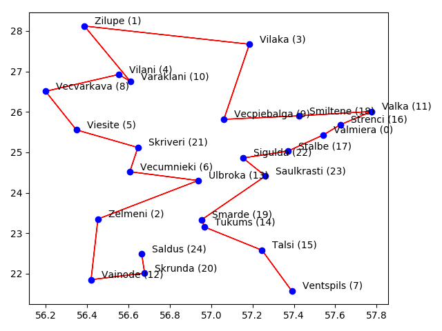

# Ant colony system implementation with Python
Build distance between cities in some country.

## How to use?

$ `cp env_example .env`  

Set env variable:  
`COUNTRY_CODE` - city of what country for getting path.  
`IS_SIMPLE_DISTANCE` - If disabled - will use google maps for distance or distance between points.  
`API_KEY` - set api key for google maps if `IS_SIMPLE_DISTANCE` is disabled.  
$ `pipenv install`  
$ `python main.py`  

#### Result:
cost: 1169359.46, path: [24, 20, 12, 2, 13, 6, 21, 5, 8, 4, 10, 1, 3, 9, 18, 11, 16, 0, 17, 22, 23, 19, 14, 15, 7]  

